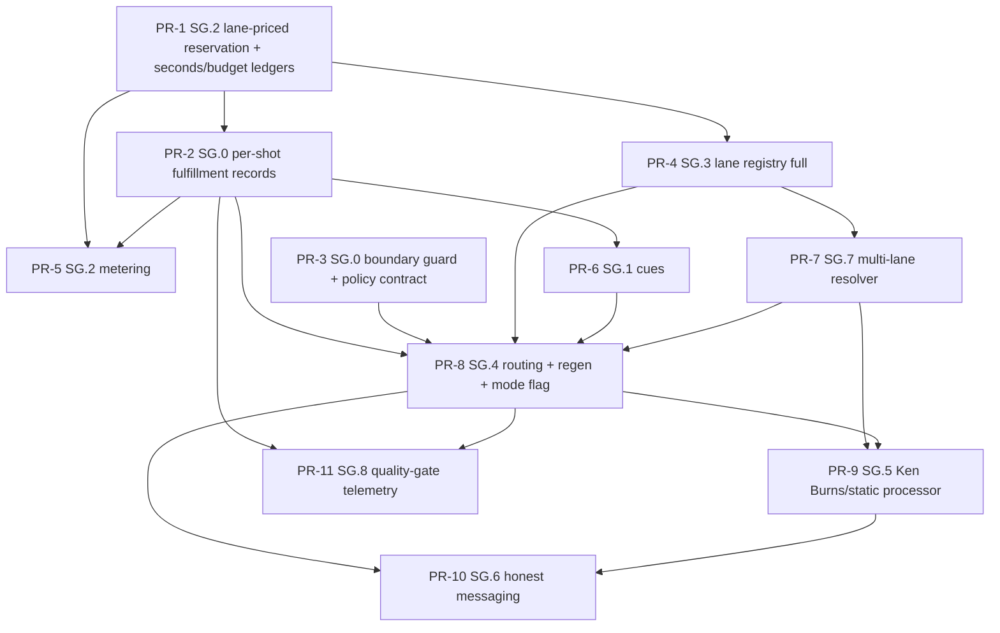

# Phase SG Implementation Lock — Selective Generation Foundation

**Status:** r3 for docs-lock PR; Architect-authored; PO-approved scope per `PO_SG_FOUNDATION_DECISION_2026-09-25.md` (sha256 `d15179548865da69b2afcfcdfbe45b1083fc9d9a5333581bc5ad1dc5d21971e1`).  
**Lock type:** **Non-Constitution implementation lock.** This document does **not** amend the Product Constitution, PHASE_2F, PHASE_M1–M8 (incl. M8.5 / M8.6), the R1 motion recipe lock, or LAUNCH_GATE. The PO decision calls the regen ceilings and provisional gates "initial policy values, not permanent Constitution locks"; this lock encodes them as **config values**.  
**Milestone name:** SG — Selective Generation foundation (fulfillment-side routing, lane registry, lane-priced reservation, budget/regen accounting, quality-gate telemetry, Ken Burns/static fallback, honest messaging, multi-lane resolver).  
**Basis:**
- PO decision (Brett, 2026-09-25 07:09 PT, verbatim via CoS)
- `ARCH_TRACK2_SG_ECON_REFINEMENT_2026-09-25.md` (sha256 `b2891c1ceffd8bb88fd35504bbe4907f177ba51a2da7ac3c155334ec2b8690e4`)
- `ARCH_TRACK2_SELECTIVE_GENERATION_PROPOSAL.md`
- Economics `BAKEOFF_DESIGN_COSTING_2026-09-25.md` + `bakeoff_reprice.py`
- Binding locks PHASE_2F / M1 / M2 / M3 / M4 / M8 / M8.5

**Main verified:** `d0bf0d8fdf7ef4830ddb2621e586d0e594a9785b` (merge PR #27; committed 2026-09-11 07:46 PT). Re-checked 2026-09-25 ~07:12 PT via a read-only shallow clone, deleted afterwards. **Main has NOT moved** past `d0bf0d8`.  
**This document:** Authoritative specification for the SG foundation implementation (PO items 1–11).
- **Nothing is implemented by this document.**
- Engineer start requires this lock merged via docs-lock PR, plus CoS Engineer assignment.
- **No spend, no bake-off execution, no vendor selection, no Wan default. LAUNCH_GATE = HOLD.**

**Filename (locked):** `PHASE_SG_FOUNDATION_IMPLEMENTATION_LOCK.md`, with sidecar `.sha256`. Companion machine-readable bake-off cell list: `PHASE_SG_BAKEOFF_CELLS_2026-09-25.csv`.  
**Do not** overwrite or mutate any PHASE_* lock, the Constitution, the R1 recipe lock, the Track 2 proposal, or the refinement.

---

## 0. Locked decisions

| ID | Decision | Lock |
| --- | --- | --- |
| D1 | Lock type | Implementation lock under the PO decision of 2026-09-25. Not Constitution; no PHASE amendment. |
| D2 | Boundary (PO) | Routing economics **never** in CreativePlan, StoryStructure, or Timeline. The creative pipeline decides *what*; fulfillment decides *how economically*. All SG state lives in **new fulfillment-side / ops tables** and config. |
| D3 | Scopes (PO) | Exactly `HERO`, `IDENTITY`, `NON_IDENTITY`. Unknown identity ⇒ `IDENTITY`. A shot carries a **required-scope set**: `{HERO}` if hero; plus `{IDENTITY}` unless identity is positively ABSENT; else `{NON_IDENTITY}`. A lane is eligible only if QUALIFIED for **every** required scope. |
| D4 | Lane policy (PO) | HERO/IDENTITY only on lanes QUALIFIED for that scope. NON_IDENTITY may use **qualified** draft-cost lanes. **Never** silently fall to an unqualified lane because it is cheaper or available. |
| D5 | Fallbacks (PO) | No eligible lane ⇒ original media where appropriate → Ken Burns/static where appropriate → wait or fail honestly. **A spend-cap hit never auto-retries**: not the same lane, not another lane, not a job retry. |
| D6 | Regeneration (PO) | Initial ceilings: draft-cost **3** attempts; all other classes **2**. After the ceiling, move up **one qualified lane class** or use a non-generation fallback. Values live in config; they are not Constitution. |
| D7 | Quality gates (PO, provisional) | Exactly these: HERO/IDENTITY minimum resolution **720p**; face similarity **median ≥ 0.70** and **minimum ≥ 0.55**; first-attempt keep **≥ 60% NON_IDENTITY** and **≥ 50% IDENTITY/HERO**; visual defects **≤ 10%**; failures **≤ 5%**. They must be validated against benchmark evidence. **Not adopted, therefore NOT gates:** regen-to-keep ≤ 3.0; "within 0.03 / 10 pts of current lane"; prompt adherence 4/5; identity artifacts ≤ 5%. These are **recorded-only diagnostics** (SG.8, PR-11) and open PO items (§7). |
| D8 | Provider policy (PO) | No vendor lock. **Wan is NOT a permanent default.** It is the bake-off **control**, and the current live R1 lane is recorded as `LEGACY_R1`. Provider/model findings are benchmark and routing inputs only. |
| D9 | Open strings, no enums | `providerKey` stays an open `String`. Scope, lane class, treatment, gate status, and outcome are `String` columns validated in app code (TS `as const` arrays + zod). Main's `prisma/schema.prisma` has **zero** `enum` blocks, per its own convention that status/provider fields are strings. These policy concepts may gain values additively (e.g. a new lane class) without enum migrations. **No Prisma enums, vendor or otherwise.** |
| D10 | GeneratedAsset untouched | No column, relation field, or semantic change on `GeneratedAsset` (M3). SG records reference GeneratedAsset rows through plain `String?` ids with app-level integrity checks. |
| D11 | Reservation (PO item 3) | Reservation = **estimated billed seconds × lane $/s from the registry**. Reconcile on completion. Release on definitive, non-billable failure. Unknown outcomes stay counted (`UNRECONCILED`). The flat `$0.50/job` reservation is retired for live backends. |
| D12 | Enforcement flag | `SG_ROUTING_MODE = LEGACY \| ENFORCED`. `LEGACY` = today's single-lane R1 behavior plus SG records and shadow decisions, except that dialogue close-ups are never generated (PR-8 step 2). `ENFORCED` = D3–D6 applied strictly. The default and any flip in a hosted environment are gated on **E-R1** (§7). |
| D13 | Gate-status authority (proposed; PO to confirm, §7 P-1) | A lane becomes `QUALIFIED` only through a reviewed registry change PR that cites signed bake-off evidence (CD verdict → Architect conformance → PO sign-off). Runtime may only **downgrade** to `SUSPENDED`, never upgrade. |
| D14 | Contracts untouched | `AssetGeneratorPort.generate(input) → GeneratedAssetDocument`, `AssetGeneratorInput`, `GeneratedAssetDocument` v1, `TimelineDocument`/`TimelineClip`, `StoryDocument`, `RenderManifest` v1 / `RendererPort`, `EntitlementSnapshot`, M8.5 billing models, `UsageEvent`/`EngineCostEvent` columns. CreativePlan has exactly two allowed changes, both non-breaking write-path denylist extensions in §5.1: (1) the routing-key set `SG_ROUTING_PLAN_KEYS` (PR-3); (2) the cost-key set `SG_COST_PLAN_KEYS` (lock r3, amendment A1; PR-8). No other CreativePlan change is allowed. |

---

## 1. Objective

Make per-shot generation decisions **explicit, auditable, lane-priced, and scope-gated** at fulfillment time, without changing creative meaning:
- (a) no HERO/IDENTITY shot reaches an unqualified lane;
- (b) spend reservation matches each lane's real cost;
- (c) regeneration and AI-video seconds are accounted for and bounded;
- (d) users get honest messages;
- (e) a formal blind bake-off can later qualify lanes with evidence.

Pipeline position (the chain is unchanged; SG sits beside M3 fulfillment):

`… → Timeline (unmetMediaRoles) → [SG: cue → route → reserve → generate/fallback → record] → GeneratedAsset → explicit Rebuild cut (M3 D9) → Render (M4) → …`

---

## 2. (A) Implementation plan

### 2.1 Evidence that per-lane reservation is the first slice

On main:
- `SpendGuard` reserves a flat `estimatedUsdPerJob` (default `0.5`; `src/server/gateways/yf-asset/config.ts` L108; `spend.ts` `recordAccepted()`), regardless of lane or duration.
- The ledger is a single global cumulative row (`GATEWAY_SPEND_LEDGER_ID = "yf-asset"`, `src/server/beta/defaults.ts`).
- On failure the gateway marks the job failed but **never releases** the reservation (`generate.ts` catch path).

Economics re-verified list rates on 2026-09-25 (`BAKEOFF_DESIGN_COSTING_2026-09-25.md` §3 and escalation E2). Comparison against the flat $0.50:

| Lane (candidate) | Cost per 5 s clip | Covered by $0.50? |
| --- | ---: | --- |
| Kling v3 Pro, audio off | 0.112 × 5 = **$0.56** | **Under-covers** by $0.06 |
| Kling v3 Pro, audio on | 0.168 × 5 = **$0.84** | **Under-covers** by $0.34 |
| Seedance 2.0 Fast | 0.2419 × 5 = **$1.21** | **Under-covers** by $0.71 (cost is 2.4× the reservation) |
| Wan 2.7 (control) | 0.10 × 5 = **$0.50** | **Zero headroom** (1080p would cost $0.75 and under-cover) |
| Boreal 720p / Pruna 480p COST | $0.05 | Over-reserves 10×, which starves the job/$ caps |

- **Under-reserving** premium lanes means the cap can be exceeded.
- **Over-reserving** cheap lanes means work the budget could afford gets denied.
- Every routing slice depends on correct reservation, so **PR-1 is first**.

### 2.2 Milestone mapping (proposal SG.0–SG.7 → lock milestones; explicit)

| Lock milestone | Proposal origin | Scope in this lock | PO items |
| --- | --- | --- | --- |
| **SG.0** Policy contract + fulfillment record + boundary guard | Proposal SG.0 "Policy contract" | Fulfillment-side per-shot records; routing constants; `SelectiveGenerationPolicy` interface; CreativePlan routing-key denylist (E8) | **1** |
| **SG.1** Cue extraction | Proposal SG.1 | Shot role + identity state → required scopes | **7** |
| **SG.2** Budget binding | Proposal SG.2 | Lane-priced reservation; AI-video seconds/budget accounting; per-lane and per-shot metering | **3, 4, 5** |
| **SG.3** Lane registry | Proposal SG.3 "Premium I2V profile", **renamed**: the R1 recipe becomes one registry entry/profile, not a special case | Registry with open `providerKey`, per-scope gate status, validators | **2** |
| **SG.4** Routing + regeneration | Proposal SG.4 "Original-first", **expanded** | Original-first; D3–D6 eligibility; ceilings and escalation; cap no-retry; LEGACY/ENFORCED flag | **6** (wires 1, 2, 7, 11) |
| **SG.5** Ken Burns/static fallback | Proposal SG.5 | Pre-rendered derived clip (the E7 no-lock-change path) | **9** |
| **SG.6** Honest messaging | Proposal SG.6 | Message keys and copy; no legal text, no pricing | **10** |
| **SG.7** Multi-lane resolver + swap test | Proposal SG.7 | Lane-scoped adapters behind the unchanged `AssetGeneratorPort`; one gateway process per lane; fal/replicate/http/mock swap test | **11** |
| **SG.8** Quality-gate telemetry & evidence (**NEW**; closes the gap flagged in the refinement) | none (gap) | Lane × scope quality snapshots; bake-off evidence ingest; gate report vs D7; diagnostics recorded-only | **8** |

### 2.3 PR slice order and dependency graph

| Order | Slice | Milestone | PO items |
| --- | --- | --- | --- |
| 1 | **PR-1** Lane-priced reservation + AI-video seconds/budget ledgers | SG.2 | 3, 5 |
| 2 | **PR-2** Fulfillment-side per-shot records | SG.0 | 1 (+ fields for 6, 7) |
| 3 | PR-3 Boundary guard + policy contract (E8) | SG.0 | 1 (boundary) |
| 4 | PR-4 Lane registry (full) + gate validators | SG.3 | 2 |
| 5 | PR-5 Per-lane / per-shot metering | SG.2 | 4 |
| 6 | PR-6 Cue extraction (shot role, identity) | SG.1 | 7 |
| 7 | PR-7 Multi-lane resolver | SG.7 | 11 |
| 8 | PR-8 Routing policy + regen ceilings + LEGACY/ENFORCED | SG.4 | 6 |
| 9 | PR-9 Ken Burns/static processor | SG.5 | 9 |
| 10 | PR-10 Honest messaging | SG.6 | 10 |
| 11 | PR-11 Quality-gate telemetry | SG.8 | 8 |



PR-3 has no upstream dependency and may land in parallel with PR-1 and PR-2. The table order is the review order.

### 2.4 Contracts untouched in **every** slice

**Untouched contracts:**
- CreativePlan schema and meaning (except the §5.1 write-path denylist, PR-3)
- StoryDocument v1
- TimelineDocument v1 + `TimelineClip` (strict) and `unmetMediaRoles`
- `GeneratedAsset` model + `GeneratedAssetDocument` v1 (strict)
- `AssetGeneratorPort` + `AssetGeneratorInput`
- `RenderManifest` v1 (strict clip schema) + `RendererPort`
- `EntitlementSnapshot` + M8.5 `Subscription` / `CreditLedger` / `CreditBalance` / `PaymentEvent` / `OfferCatalog`
- `UsageEvent` / `EngineCostEvent` columns
- Job types (`AI_ASSET` only; no new job aliases)
- All PHASE lock files

**Migrations are additive only:**
- new tables;
- new defaulted columns on the ops table `GatewaySpendLedger`;
- virtual back-relation list fields on `Project` (no column change on `project`).

No drops, renames, or type changes.

### 2.5 Slice specifications

#### PR-1: Lane-priced reservation + AI-video seconds/budget accounting (SG.2; items 3, 5)

**Lane rate source v0.** A read-only registry file, grown into the full registry by PR-4.
- Path: `SG_LANE_REGISTRY_PATH`, default `config/sg-lane-registry.json`.
- PR-1 fields per lane: `laneId`, `providerKey`, `usdPerSecond`, `clipDurationS`, `supportedDurationsS[]`, `billingGranularityS`, `failuresBillable` (bool), `rateRef` (citation).
- The file contains no secrets.

**Gateway changes** (process-local config; the port is unchanged):
- New env `YF_GATEWAY_LANE_ID`, **required when `YF_GATEWAY_BACKEND ≠ mock`**. The lane must exist in the registry with `usdPerSecond > 0`; otherwise the gateway **fails closed** at boot.
- `YF_GATEWAY_ESTIMATED_USD_PER_JOB` remains for `mock` only. On a live backend it is ignored with a boot warning and can never be the sole rate.
- New optional env `YF_GATEWAY_LEDGER_ID` (default `yf-asset`). This is how the bake-off envelope is isolated (§6.9).
- Billed-seconds estimate:
  - `D_req` = `extraInput.duration` if numeric, else the lane's `clipDurationS`.
  - `D_bill` = smallest `supportedDurationsS` value ≥ `D_req`, rounded up to `billingGranularityS`.
  - `estUsd = D_bill × usdPerSecond`.
  - `D_req > max(supportedDurationsS)` ⇒ 400.
- Per-shot variable duration is **not** passed from the app. That would need an `AssetGeneratorInput` field, which is a locked M3 contract. Every call on a lane bills that lane's configured clip duration.

**Settlement matrix:**

| Event | Reservation status | Ledger effect |
| --- | --- | --- |
| Cap would be exceeded at reserve | none created | 429 `GATEWAY_SPEND_CAP`; backend **not** called |
| Backend submit rejected (no provider job created) | `RELEASED` | reserved amount removed |
| Backend status `failed` | `RELEASED` if `failuresBillable=false`; else `RECONCILED` at the estimate | removed, or reserved → committed |
| Success | `RECONCILED`; `actualBilledSeconds` = returned `durationMs` rounded up to granularity (falls back to the estimate, flagged) | committed += actual; reserved −= estimate; spend adjusted by (actual − estimate) |
| Download failure after backend success | `RECONCILED` (the generation was billed) | same as success |
| Timeout, app abort, or cancel (e.g. Replicate: "cancel of official model may be charged") | `UNRECONCILED` (stays counted) | unchanged until ops reconcile |

Economics: failures are not billed on fal, Replicate, or Google; Pruna's policy is UNVERIFIED (BAKEOFF costing §2). The default is `failuresBillable = true` for any lane without a verified no-bill policy.

**Schema (Prisma; additive):**

```prisma
model GatewaySpendLedger {           // EXISTING (Wave 1 ops table): additive columns only
  // existing: id String @id, jobsAccepted Int, spendUsd Float, updatedAt, createdAt
  reservedUsd     Float  @default(0)        // outstanding (RESERVED + UNRECONCILED) portion of spendUsd
  billedSeconds   Float  @default(0)        // committed + outstanding billed seconds
  reservedSeconds Float  @default(0)        // outstanding portion of billedSeconds
  scopeKind       String @default("GLOBAL") // GLOBAL | LANE | BAKEOFF | BAKEOFF_CELL (open string, app-validated)
}
// Row ids (open strings): "yf-asset" (existing global), "lane:<laneId>", "bakeoff:<runId>", "bakeoff:<runId>:cell:<cellId>"

model GatewaySpendReservation {
  id                     String    @id @default(cuid())
  ledgerIds              String[]  // rows charged; locked in ascending id order
  laneId                 String
  providerKey            String    // open provenance string, never an enum
  capability             String
  modelId                String?
  idempotencyKey         String    @unique
  gatewayJobId           String?   @unique
  requestedDurationS     Float
  estimatedBilledSeconds Float
  usdPerSecond           Float
  reservedUsd            Float
  actualBilledSeconds    Float?
  actualUsd              Float?
  status                 String    @default("RESERVED") // RESERVED | RECONCILED | RELEASED | UNRECONCILED
  settleReason           String?
  createdAt              DateTime  @default(now())
  settledAt              DateTime?

  @@index([laneId, createdAt])
  @@index([status, createdAt])
  @@map("gateway_spend_reservation")
}

model AiVideoBudgetLedger {
  id               String   @id                     // "project:<projectId>" | "user:<userId>:<windowKey>"
  scopeKind        String                           // PROJECT | USER_WINDOW
  projectId        String?
  userId           String?
  windowKey        String?                          // e.g. UTC date "2026-09-25"
  reservedSeconds  Float    @default(0)
  committedSeconds Float    @default(0)
  reservedUsd      Float    @default(0)
  committedUsd     Float    @default(0)
  attempts         Int      @default(0)
  createdAt        DateTime @default(now())
  updatedAt        DateTime @updatedAt

  @@index([projectId])
  @@index([userId, windowKey])
  @@map("ai_video_budget_ledger")
}

model AiVideoBudgetReservation {
  id                     String    @id @default(cuid())
  projectId              String
  project                Project   @relation(fields: [projectId], references: [id], onDelete: Cascade)
  userId                 String
  ledgerIds              String[]
  laneId                 String
  providerKey            String
  idempotencyKey         String    @unique
  estimatedBilledSeconds Float
  usdPerSecond           Float
  estimatedUsd           Float
  actualBilledSeconds    Float?
  actualUsd              Float?
  status                 String    @default("RESERVED") // RESERVED | RECONCILED | RELEASED | UNRECONCILED
  settleReason           String?
  gatewayReservationId   String?
  createdAt              DateTime  @default(now())
  settledAt              DateTime?

  @@index([projectId, createdAt])
  @@index([userId, createdAt])
  @@index([status])
  @@map("ai_video_budget_reservation")
}
// Project gains the virtual back-relation `aiVideoBudgetReservations AiVideoBudgetReservation[]` (no column change).
```

**Budget caps (item 5):** ops config, fail-safe.
- New optional envs: `SG_BUDGET_PROJECT_MAX_SECONDS`, `SG_BUDGET_PROJECT_MAX_USD`, `SG_BUDGET_USER_WINDOW_MAX_SECONDS`, `SG_BUDGET_USER_WINDOW_MAX_USD`, and on the gateway, optional `YF_GATEWAY_MAX_BILLED_SECONDS` and `YF_GATEWAY_LANE_MAX_SPEND_USD`.
- An unset value means that scope is not enforced. The global gateway job and $ caps remain **mandatory and fail-closed**, as today.
- **Numbers are not set here (E9).** Per-plan differentiation is out of scope; later it flows through `EntitlementService` per M8.5 D3. PR-1 only exposes `AiVideoBudgetSource.resolve(userId, projectId)`, which returns the ops caps.

**App side:**
- `AssetService` reserves project and user-window budget **before** calling the adapter, using the same lane rate. The gateway then reserves global + lane.
- On a gateway 429 or an app-budget denial:
  - release the app reservation;
  - record `CAP_DENIED`;
  - throw the new typed `AppError` `SPEND_CAP_REACHED`. It is non-retryable, because `AssetWorker` retries only non-`AppError` errors.
- `HttpAssetGeneratorAdapter` maps gateway `429 GATEWAY_SPEND_CAP` to `SPEND_CAP_REACHED`. Today every gateway error maps to `assetProviderUnavailable`. This is an internal adapter change; the port is unchanged.
- **Deletion:** the account-delete path and `docs/BETA_WIPE_RUNBOOK.md` must purge `AiVideoBudgetLedger` rows keyed by `userId`. Project-keyed rows cascade.

**Tests:**
- **Unit:**
  - Estimate table using Economics rates as *fixtures*: Kling audio-off 5 s → $0.56; Seedance 5 s → $1.2095; Wan 5 s → $0.50; Boreal 5 s → $0.05; Veo with supported [4, 6, 8] and `D_req` 5 → bills 6 s.
  - Rounding and granularity.
  - Every settlement-matrix transition.
  - Idempotent reserve: the same key returns the existing row.
  - Double release and double reconcile are no-ops; reconcile after release is rejected.
- **Integration (Postgres):**
  - Restart does not reset ledgers.
  - `/api/ops/spend` still returns the global row, with additive fields only.
  - A bake-off ledger id is isolated from `yf-asset`.
- **Concurrency:**
  - 50 parallel reserves against a cap that allows 10 → exactly 10 succeed; 40 get 429 with no backend call.
  - Two gateway processes on one DB are serialized by `SELECT … FOR UPDATE`.
  - Multi-row locking in ascending id order under interleaved global + lane + cell reservations → no deadlock.
  - Parallel reconcile and release on one reservation → exactly one wins.
- **Fail-closed:**
  - The gateway refuses to start on: a live backend without `YF_GATEWAY_LANE_ID`; an unknown lane; `usdPerSecond ≤ 0`; missing `DATABASE_URL`; invalid registry JSON.
  - A cap hit ⇒ 429, and the backend mock records zero submits.
  - A job ending in `SPEND_CAP_REACHED` is **not retried** (Job `FAILED`, `attempts = 1`), and **no other lane is tried** for that shot.

**Acceptance:**
- No live-backend path reserves a flat per-job amount.
- Every reservation carries lane, `providerKey`, billed seconds, and $/s.
- Failed jobs are released or stay counted according to the settlement matrix.
- Cap hits never retry.
- Seconds are accounted globally, per lane, per project, and per user window.

#### PR-2: Fulfillment-side per-shot records (SG.0; item 1, with fields for items 6 and 7)

```prisma
model ShotFulfillment {
  id                 String   @id @default(cuid())
  projectId          String
  project            Project  @relation(fields: [projectId], references: [id], onDelete: Cascade)
  timelineId         String            // plain id; no FK (M2/M3 models untouched)
  timelineVersion    Int
  role               String
  storySceneId       String?
  slotKey            String            // deterministic "<timelineId>:<timelineVersion>:<role>:<storySceneId|->"
  scope              String            // HERO | IDENTITY | NON_IDENTITY (primary; see requiredScopes)
  requiredScopes     String[]          // subset of {HERO, IDENTITY, NON_IDENTITY}
  shotRole           String?           // hero | establishing | insert | transition | dialogue-closeup | other (cue)
  identityState      String   @default("UNKNOWN") // PRESENT | ABSENT | UNKNOWN (UNKNOWN ⇒ IDENTITY)
  identityEvidence   Json?             // counts/booleans only; never embeddings or face crops
  motionNeed         String?           // none | low | high
  slotDurationMs     Int?
  treatment          String            // ORIGINAL | KEN_BURNS | STATIC | REUSE | GENERATE | DEFER | FAIL_HONEST
  status             String   @default("PLANNED") // PLANNED | IN_PROGRESS | FULFILLED | FALLBACK | DEFERRED | FAILED | SUPERSEDED
  routingMode        String            // LEGACY | ENFORCED (D12)
  shadowDecision     Json?             // what ENFORCED would have decided while running in LEGACY
  currentLaneClass   String?
  currentLaneId      String?
  currentProviderKey String?
  attemptsTotal      Int      @default(0)
  decisionReason     String
  userMessageKey     String?           // SG.6 key
  registryVersion    String
  registrySha256     String
  treatmentParams    Json?             // e.g. Ken Burns deterministic params
  generatedAssetId   String?           // plain id; no relation (GeneratedAsset untouched)
  sourceMediaAssetId String?
  createdAt          DateTime @default(now())
  updatedAt          DateTime @updatedAt
  attempts           ShotFulfillmentAttempt[]

  @@unique([projectId, slotKey])
  @@index([projectId, createdAt])
  @@index([timelineId, role])
  @@index([status])
  @@map("shot_fulfillment")
}

model ShotFulfillmentAttempt {
  id                     String          @id @default(cuid())
  shotFulfillmentId      String
  shot                   ShotFulfillment @relation(fields: [shotFulfillmentId], references: [id], onDelete: Cascade)
  attemptNo              Int                     // 1-based across the slot
  classAttemptNo         Int                     // 1-based within laneClass (ceiling accounting)
  laneClass              String
  laneId                 String
  providerKey            String
  modelId                String?
  requiredScopes         String[]
  jobId                  String?                 // AI_ASSET Job id
  gatewayJobId           String?
  budgetReservationId    String?
  gatewayReservationId   String?
  estimatedBilledSeconds Float
  actualBilledSeconds    Float?
  usdPerSecond           Float
  estimatedUsd           Float
  actualUsd              Float?
  outcome                String          @default("PENDING") // PENDING | SUCCEEDED | FAILED | CAP_DENIED | TIMEOUT_UNRECONCILED | CANCELLED | REJECTED_TECHNICAL
  failureCode            String?
  keepSignal             String?                 // KEPT | REJECTED_BY_USER | null (no automated keep)
  outputWidth            Int?
  outputHeight           Int?
  generatedAssetId       String?
  startedAt              DateTime        @default(now())
  finishedAt             DateTime?

  @@unique([shotFulfillmentId, attemptNo])
  @@index([laneId, startedAt])
  @@index([providerKey])
  @@index([jobId])
  @@map("shot_fulfillment_attempt")
}
// Project gains the virtual back-relation `shotFulfillments ShotFulfillment[]` (no column change).
```

**Write rules:**
- These records are written only by fulfillment (`AssetService`). Director, Story, and Timeline services never write them.
- A new Timeline version creates new slots; the prior slots become `SUPERSEDED`.
- `generatedAssetId` must reference a GeneratedAsset in the same project; the app checks this.

**Tests:**
- A record is created for every processed unmet role.
- Re-enqueue is idempotent via the unique `slotKey`.
- Rows cascade on project delete.
- A privacy walker rejects float arrays, image bytes, and base64 in `identityEvidence`.
- Snapshot tests prove Story, Timeline, and CreativePlan payloads are unchanged.
- A schema diff test proves GeneratedAsset is unchanged.
- Concurrency: two workers on one slot produce a single `attemptNo` sequence (unique constraint + retry-on-conflict).

**Acceptance:** every generation attempt has exactly one attempt row, linked to its reservation rows, lane, `providerKey`, scopes, and outcome. Routing metadata exists **only** here and in ops tables.

#### PR-3: Boundary guard + policy contract (SG.0; E8)

- `src/server/sg/constants.ts` defines, as `as const` arrays + zod:
  - `ROUTING_SCOPES`
  - `LANE_CLASSES` (`draft-cost`, `draft-quality`, `standard`, `premium`)
  - `TREATMENTS`
  - `GATE_STATUSES` (`NOT_QUALIFIED`, `QUALIFIED`, `SUSPENDED`)
  - `ATTEMPT_OUTCOMES`
- `SelectiveGenerationPolicy.decide(cues, registrySnapshot, budgetSnapshot, attemptsSoFar) → RouteDecision`: a pure function with no I/O.
- The **E8 guard** (§5.1): `SG_ROUTING_PLAN_KEYS` added to the CreativePlan write-path denylist.
- Regression tests pin that routing keys are rejected by the Story, Timeline, and GeneratedAssetDocument schemas, which are already strict.

**Acceptance:**
- A new Director compose output that contains routing keys fails with the typed `directorPlanInvalid`.
- Stored plans read unchanged.
- The policy is unit-testable without a DB.

#### PR-4: Lane registry (SG.3; item 2)

**Registry schema v1:** extends the PR-1 file; zod-validated; carries `registryVersion`.

Per-lane fields:

| Field | Meaning |
| --- | --- |
| `laneId`, `laneClass` | Identity and class |
| `providerKey` | Open string. `"TBD:<laneId>"` allowed only while `enabled:false`. |
| `modelId` | Open string |
| `gateway.baseUrlEnv`, `gateway.apiKeyEnv` | Env var **names** only; no secret values |
| `resolutionTier` | `480p` \| `720p` \| `768p` \| `1080p` \| `pro` |
| `usdPerSecond`, `rateRef` | Rate and citation |
| `clipDurationS`, `supportedDurationsS`, `billingGranularityS` | Duration and billing rounding |
| `failuresBillable` | Whether failed attempts are billed |
| `audioMode` | `OFF` \| `STRIP` |
| `enabled` | Whether the lane can be used |
| `designation` | `NONE` \| `LEGACY_R1` (**`DEFAULT` is not an allowed value**) |
| `gates.{HERO,IDENTITY,NON_IDENTITY}` | `{status, evidenceSha256?, signoffRef?, date?}` |

Policy block:
- `regenCeilings` = `{draft-cost: 3, draft-quality: 2, standard: 2, premium: 2}`
- `classOrder` = `[draft-cost, draft-quality, standard, premium]`
- `thresholdsVersion`

**Validators** (fail closed: an invalid registry yields zero eligible lanes plus an ops alert):
- `QUALIFIED` requires both `evidenceSha256` and `signoffRef`.
- `QUALIFIED` for HERO or IDENTITY requires `resolutionTier ≥ 720p`. A 480p lane can never be QUALIFIED for HERO/IDENTITY.
- An enabled lane must have a non-TBD `providerKey`.
- `designation: DEFAULT` is rejected.
- The runtime override `SG_LANES_SUSPENDED=laneA,laneB` can only downgrade a lane to `SUSPENDED`.

**Initial content:** see §4.

**Tests:**
- every validator case;
- the registry sha is recorded on each decision;
- no secrets in the file (scan for key-like values);
- the runtime override is downgrade-only.

**Acceptance:** at merge, nothing is QUALIFIED, and the R1 lane is present as `LEGACY_R1`, not as a default.

#### PR-5: Per-lane / per-shot metering (SG.2; item 4)

- On settle, write:
  - a `UsageEvent` with kind **`AI_VIDEO_SECONDS`** (the kind is an open string on main), quantity = billed seconds, plus the outcome;
  - an `EngineCostEvent` with `providerKey`, `capability`, `costUnits` = billed seconds (units, not currency), and `costKind` = `ESTIMATED` (based on list rates).
- The existing `ASSET_CALL` event is unchanged. **No column changes.**
- USD stays in the SG reservation and attempt tables (ops only).
- Ops rollups behind `BETA_OPS_SECRET`:
  - `/api/ops/spend` gains lane and budget ledger rows (additive);
  - new `/api/ops/sg/lanes`: per lane × scope × day attempts, billed seconds, estimated/actual USD, and outcomes.

**Tests:**
- events are emitted once per settle (idempotent);
- a walker proves no cost field reaches CreativePlan, Story, or Timeline;
- ops routes return 404 without the secret.

**Acceptance:** per-shot and per-lane cost can be traced end to end: attempt → reservation → usage event.

#### PR-6: Cue extraction, shot role + identity state (SG.1; item 7)

`ShotCueExtractor` is read-only. Its inputs:
- the StoryDocument scene: `dramaticFunction`, `purpose`, `dialogueOutline`, `mediaRoles`;
- the Timeline unmet role and slot timing;
- the start frame's `MediaAnalysis`: `people.faceDetected`, `recurringPersonIds`, `people.count`, `locations`, `cameraMovement`.

Rules:
- **Identity state:**
  - `PRESENT` if any face is detected or `recurringPersonIds` is non-empty;
  - `ABSENT` only if analysis is `COMPLETED` with `people.count = 0` and no face;
  - otherwise `UNKNOWN`, which is treated as `IDENTITY`.
- **Hero:** `dramaticFunction ∈ {climax, turning, inciting}`, or a Director `scene_emphasis` decision names the scene.
- **Required scopes:** per D3.
- **Dialogue close-ups** (scene has a `dialogueOutline` and identity is PRESENT or UNKNOWN; recorded as `shotRole = "dialogue-closeup"`): **never generated, in either `LEGACY` or `ENFORCED` mode** (PR-8 step 2). The treatment comes only from the PO's **E12** decision; a generated dialogue/talking-face treatment remains a possible later E12 decision, subject to quality/safety gates and a further lock amendment. Until E12 is decided: ORIGINAL if the original media covers the slot, otherwise `DEFER`.
- **Known limitation (r3, A2):** identity is UNKNOWN for every non-ENHANCEMENT role, so today every automatic role in a scene with a `dialogueOutline` counts as a dialogue close-up. This is a known classification limitation, not a rule that wide or establishing shots containing dialogue are dialogue close-ups. It is flagged for future SG work (PR-8 / follow-up).
- Cues persist **only** on `ShotFulfillment`.

**Tests:**
- identity truth table, including analysis FAILED or QUEUED ⇒ UNKNOWN;
- hero detection;
- a spy proves the extractor never writes Story or Timeline;
- no embeddings are stored.

**Acceptance:** every slot has a scope and an identity state, and UNKNOWN never maps to NON_IDENTITY.

#### PR-7: Multi-lane resolver (SG.7; item 11)

- `resolveAssetGeneratorLanes(storage, registry)` returns:
  - `forLane(laneId) → { adapter: AssetGeneratorPort; attribution(capability) }`;
  - `processors(capability)` for MEDIA_ENHANCEMENT (PR-9).
- Each lane gets its own `HttpAssetGeneratorAdapter` instance, configured from the lane's gateway env names, `modelId`, and `providerKey`.
- **`AssetGeneratorPort` and `AssetGeneratorInput` are unchanged.** The lane is chosen by *which adapter instance* is called, not by an input field. **No port change is required.**
- Attribution now reports the lane's real `providerKey`/`modelId`. This fixes a gap on main, where a per-request `model` override kept the gateway-level `providerKey`.
- **Gateway topology:** one existing single-lane gateway process per enabled lane, identified by `YF_GATEWAY_LANE_ID` (PR-1). No gateway rewrite. The legacy `ASSET_HTTP_*` config maps to the `LEGACY_R1` lane.
- **Swap test:** the same policy decisions run against `fal`, `replicate`, `http`, and `mock` backends (mock in CI) and produce identical SG records apart from `providerKey`.

**Tests:**
- distinct adapters per lane;
- disabled or TBD lanes cannot be resolved;
- `describeAssetAvailability` stays honest per capability;
- a compile-time check that the port type is unchanged.

**Acceptance:** one app process can serve more than one lane with correct provenance.

#### PR-8: Routing policy + regeneration (SG.4; item 6)

**Decision order:**
1. If the original media covers the slot → `ORIGINAL`.
2. If the slot is a dialogue close-up (PR-6 `shotRole = "dialogue-closeup"`) → **no generation, in either `LEGACY` or `ENFORCED` mode.** The treatment is the one set by the PO's E12 decision. Until E12 is decided, it is ORIGINAL when the original media covers the slot (step 1) and `DEFER` otherwise. If the E12 treatment cannot be applied to the slot (for example, STATIC or KEN_BURNS with no source still), it is `DEFER`. A dialogue close-up never makes a gateway or provider call, never takes a spend reservation (hold), and never opens a paid attempt.
3. Otherwise, **eligible lanes** are those that are:
   - enabled and healthy (gateway `/health` ok);
   - not SUSPENDED;
   - `QUALIFIED` for **all** `requiredScopes`;
   - below the class ceiling for this slot;
   - within budget (project, user, global, and lane).

   NON_IDENTITY starts at `draft-cost`. HERO/IDENTITY start at the lowest class that holds a lane QUALIFIED for every required scope.
4. If no lane is eligible → `KEN_BURNS` or `STATIC` when a source still exists; otherwise `DEFER` or `FAIL_HONEST`, with a message key.

**Ceilings:**
- Once `classAttemptNo` reaches the class ceiling (3 for draft-cost, 2 for the others), move to the **next higher class that has a QUALIFIED, healthy lane** for the required scopes. This is a single step; otherwise fall back.
- A cap denial ends generation for that shot. After a **global** or **project** cap hit, generation also stops for the rest of that job.
- **No automatic retry anywhere.**

**Keep signal:**
- There is no automated quality judgment.
- An attempt counts as not kept if it fails, is technically rejected (wrong duration or mime, or below the scope's resolution floor), or the user explicitly regenerates that shot.
- User-initiated regenerations count toward the same ceilings. Whether they are metered or charged is open (P-3).

**Mode:**
- `LEGACY`: the call goes to the `LEGACY_R1` lane exactly as today, **except dialogue close-ups, which are never generated (step 2)**; the slot record stores `routingMode=LEGACY` plus `shadowDecision`.
- `ENFORCED`: D3–D6 applied strictly.
- The shipped default and any hosted flip require **E-R1** (§7). Under LAUNCH_GATE HOLD there are no invited users.

**Tests:**
- The full decision table:
  - HERO with no qualified lane → fallback;
  - IDENTITY never routed to draft;
  - NON_IDENTITY routed only to qualified draft-cost lanes;
  - 480p never used for HERO/IDENTITY;
  - after 3 draft-cost attempts, escalate one qualified class;
  - at the top class, fall back;
  - SUSPENDED lanes are skipped;
  - unhealthy lanes are skipped without falling to an unqualified lane.
- Cap hit: no retry and no alternate lane.
- Dialogue close-up, in both LEGACY and ENFORCED: zero generate calls, zero spend reservations (holds), zero paid attempts; treatment = the E12 value, or ORIGINAL / `DEFER` until E12 is decided.
- LEGACY behavior is unchanged versus the current `AssetService` (golden test), except that dialogue close-ups are not generated (step 2).

**Acceptance:** in ENFORCED mode with the initial registry (nothing QUALIFIED), zero generation calls are made and every slot gets an honest fallback or defer.

#### PR-9: Ken Burns/static fallback (SG.5; item 9)

Per the §5.2 verdict, `KenBurnsProcessor` is a **production** `MEDIA_ENHANCEMENT` processor.
- **Input:** an IMAGE `MediaAsset` id, plus deterministic params from the slot record:
  - duration = slot duration clamped to [2 s, 8 s];
  - scale 1.00→1.08 (STATIC: 1.00→1.00);
  - pan anchored at a detected face, or at the centre.
- **Output:** H.264 mp4, no audio, at the project's render profile resolution, stored via StoragePort.
- **Persistence:** `GeneratedAsset` with `kind=ENHANCEMENT`, `origin=PROCESSED`, `sourceMediaAssetId` = the still, `capability=MEDIA_ENHANCEMENT`, `providerKey="yf.kenburns.v1"` (open string).
- Params are stored only in `ShotFulfillment.treatmentParams`.
- The clip enters the cut **only through an explicit Rebuild cut** (M3 D9).

**Tests:**
- mime/kind consistency (`mimeMatchesKind(ENHANCEMENT, video/mp4)` is already true on main);
- deterministic checksum for fixed params;
- no Timeline write on success;
- M4 manifest schema snapshot unchanged;
- availability is honest only when the processor is configured, and is never the local deterministic placeholder.

**Acceptance:** the fallback produces a renderable GENERATED_ASSET clip with **zero** manifest or timeline schema change.

#### PR-10: Honest messaging (SG.6; item 10)

User-visible copy contains no provider names, prices, credit amounts, legal claims, or upgrade prompts.

| Key | Copy (draft; final copy approval: PO/product) |
| --- | --- |
| `SG_FALLBACK_ORIGINAL` | "We used your original photo or video for this moment." |
| `SG_FALLBACK_KEN_BURNS` | "This moment uses your photo with gentle camera movement instead of a generated clip." |
| `SG_FALLBACK_STATIC` | "This moment shows your photo as a still." |
| `SG_NO_QUALIFIED_LANE` | "We can't make a moving clip for this moment at our quality bar yet, so we used your photo instead." |
| `SG_CEILING_REACHED` | "We tried a few versions of this moment and none met our quality bar, so we used your photo instead." |
| `SG_WAITING` | "This moment is waiting for a clip. Your movie can still be built without it." |
| `SG_CAP_REACHED` | "Clip generation is paused because a usage limit was reached. We did not retry automatically." |
| `SG_FAILED_HONEST` | "We couldn't make a clip for this moment. Nothing in your story was changed." |
| `SG_REBUILD_HINT` | "Rebuild your cut to include the updated moments." |

Messages are shown per role in the M3 "Missing pieces" panel.

**Tests:**
- every non-GENERATE decision has a key;
- copy contains no registry `providerKey` or model substrings, no currency symbols or amounts, and no "upgrade" or "buy" wording.

**Acceptance:** no silent downgrade; every fallback is visible to the user.

#### PR-11: Quality-gate telemetry & evidence (SG.8; item 8, closing the gap)

```prisma
model LaneQualitySnapshot {
  id                String    @id @default(cuid())
  laneId            String
  providerKey       String
  scope             String    // HERO | IDENTITY | NON_IDENTITY
  source            String    // BAKEOFF | PRODUCTION_PROXY
  thresholdsVersion String    // e.g. "po-sg-2026-09-25"
  windowStart       DateTime?
  windowEnd         DateTime?
  slots             Int
  attempts          Int
  firstAttemptKept  Int?
  defectClips       Int?
  failures          Int
  faceSimMedian     Float?
  faceSimMin        Float?
  resolutionOk      Boolean?
  gateResults       Json      // {resolution, faceSimMedian, faceSimMin, firstAttemptKeep, defects, failures}: PASS | FAIL | NOT_MEASURED
  diagnostics       Json?     // RECORDED-ONLY: regenToKeep, deltaVsControl, promptAdherence, identityDefectRate, keepCi95, raterKappa
  evidenceSha256    String?
  createdAt         DateTime  @default(now())

  @@index([laneId, scope, createdAt])
  @@map("lane_quality_snapshot")
}
```

- **Thresholds file:** `config/sg-quality-thresholds.json`, version `po-sg-2026-09-25`, holding **exactly** the D7 numbers.
- **`evaluateGate(snapshot)`** produces a PASS/FAIL report. It is **informational and never mutates the registry** (D13).
- **PRODUCTION_PROXY snapshots** are labelled as proxies and are **never** qualification evidence:
  - first-attempt kept = attempt 1 reached READY and was not user-regenerated before the Rebuild cut;
  - failures come from attempt outcomes;
  - no face similarity is computed on production user photos until **E11**.
- **BAKEOFF ingest** validates the §6.10 CSV and JSON against their sha256 before writing snapshots.

**Tests:**
- threshold values are exact;
- non-adopted metrics appear only in `diagnostics`;
- proxy and bake-off snapshots stay separate;
- ingest rejects a sha mismatch.

**Acceptance:** the Architect and PO can see PASS/FAIL against D7 per lane × scope, from signed evidence.

### 2.6 Traceability (item → milestone → slice → schema → tests → acceptance)

| PO item | Milestone | Slice | Schema | Key tests | Acceptance |
| --- | --- | --- | --- | --- | --- |
| 1 Per-shot routing records outside CreativePlan/Timeline | SG.0 | PR-2 (+PR-3 guard) | `ShotFulfillment`, `ShotFulfillmentAttempt` | idempotent slot; cascade; creative payloads unchanged; GeneratedAsset diff = 0 | every attempt recorded, fulfillment-side only |
| 2 Lane registry, open providerKey | SG.3 | PR-4 | config file (no DB) | validators; 480p never HERO/ID; no `DEFAULT`; runtime downgrade-only | nothing QUALIFIED at merge; R1 = LEGACY_R1 |
| 3 Lane-specific reservation | SG.2 | **PR-1** | `GatewaySpendLedger` (+cols), `GatewaySpendReservation` | rate fixtures; concurrency; settlement matrix; fail-closed | no flat $/job on live backends; release/reconcile correct |
| 4 Per-lane/per-shot metering | SG.2 | PR-5 | none (open `UsageEvent.kind` = `AI_VIDEO_SECONDS`) | idempotent emission; walker | attempt → reservation → usage traceable |
| 5 AI-video seconds/budget accounting | SG.2 | **PR-1** | `AiVideoBudgetLedger`, `AiVideoBudgetReservation` | project/user caps; seconds caps; deletion purge | seconds bounded per scope (numbers: E9) |
| 6 Regen accounting + ceilings | SG.4 | PR-8 (fields in PR-2) | `classAttemptNo`, `attemptsTotal` | ceilings 3/2; one-step qualified escalation; cap no-retry | ceilings enforced; never an unqualified lane |
| 7 Shot role + identity state | SG.1 | PR-6 | fields on `ShotFulfillment` | identity truth table; UNKNOWN ⇒ IDENTITY | every slot scoped |
| 8 Quality-gate telemetry | **SG.8** | PR-11 | `LaneQualitySnapshot` | exact thresholds; diagnostics recorded-only | PASS/FAIL visible; never auto-qualifies |
| 9 Ken Burns/static fallback | SG.5 | PR-9 | none new (GeneratedAsset ENHANCEMENT row via the existing M3 path) | deterministic output; manifest unchanged | renderable fallback, no lock change |
| 10 Honest messaging | SG.6 | PR-10 | none | copy lint; key coverage | every fallback visible; no legal text or pricing |
| 11 Multi-lane resolver | SG.7 | PR-7 | none | per-lane adapters; port unchanged; swap test | multiple lanes with correct provenance |

---

## 3. OUT OF SCOPE (explicit)

- Any change to the Product Constitution, PHASE_2F, PHASE_M1–M8 (including M8.5/M8.6), the R1 recipe lock, or LAUNCH_GATE (**HOLD**).
- Commercial pricing, entitlement tiers/plans, credit coefficients, plan-level budget numbers (E9), and customer-visible cost display.
- Vendor selection or lock. Designating Wan, or any lane, as default: `designation: DEFAULT` is not a valid registry value.
- Bake-off **execution** or spend, Creative Director keep-evaluation execution, and large paid experiments. Only the **design** (§6) is authorized.
- Public beta or invites.
- Per-shot variable generation duration, which would need an `AssetGeneratorInput` field (a locked M3 contract).
- Render-time motion parameters in the M4 manifest (see §5.2).
- Automated quality classifiers that decide "keep".
- Production face-embedding computation on user photos (E11).

---

## 4. Lane registry: initial content, qualification path, R1 transition

**Initial entries.** Every gate is `NOT_QUALIFIED` for **every** scope. Rates are copied from Economics with `rateRef` citations. They are reservation config only: not prices, and not a selection.

| laneId | laneClass | providerKey | Tier | usdPerSecond (rateRef) | clip s / supported | enabled | designation |
| --- | --- | --- | --- | --- | --- | --- | --- |
| `r1-wan27-replicate` | standard | `replicate:wan-video/wan-2.7-i2v` (main's default string) | 720p | 0.10 (Economics BAKEOFF §2, Replicate VERIFIED 2026-09-25) | 5 / [5] (R1 lock; confirm Wan's range) | **true** (legacy) | `LEGACY_R1` |
| `boreal-720` | draft-cost | `TBD:boreal-720` | 720p | 0.01 | 5 / TBD | false | NONE |
| `pruna-480-cost` | draft-cost | `TBD:pruna-480-cost` | 480p | 0.01 | 5 / TBD | false | NONE |
| `pruna-768-cost` | draft-cost | `TBD:pruna-768-cost` | 768p | 0.025 | 5 / TBD | false | NONE |
| `h3turbo-768` | draft-quality | `TBD:h3turbo-768` | 768p | 0.04 (LIST; promo excluded) | 5 / TBD | false | NONE |
| `veo31lite-720` | draft-quality | `TBD:veo31lite-720` | 720p | 0.03 no-audio (fal reference) / 0.05 with audio, per `audioMode` and transport | 6 / [4, 6, 8] (VERIFIED) | false | NONE |
| `pruna-768-quality` | draft-quality | `TBD:pruna-768-quality` | 768p | 0.075 | 5 / TBD | false | NONE |
| `kling3-pro-audio-off` | premium | `TBD:kling3-pro-audio-off` | pro (1080p UNVERIFIED) | 0.112 | 5 / TBD | false | NONE |
| `seedance2-fast-720` | premium | `TBD:seedance2-fast-720` | 720p | 0.2419 (audio always billed) | 5 / TBD | false | NONE |
| processor `yf.kenburns.v1` | processor | `yf.kenburns.v1` | output profile | 0 (compute only) | slot-derived | per config | n/a (non-generative) |

**How a lane becomes QUALIFIED for a scope** (the same path applies to NON_IDENTITY draft-cost lanes):
1. It passes the D7 gates for that scope on bake-off evidence (§6). For NON_IDENTITY that means first-attempt keep ≥ 60%, defects ≤ 10%, and failures ≤ 5%, with no resolution or face-similarity requirement.
2. The verdict is signed in order: CD keep verdict → Architect conformance → PO sign-off.
3. A registry PR sets `status: QUALIFIED` with `evidenceSha256` and `signoffRef`.

The PO text reads "NON_IDENTITY may use **qualified** draft-cost lanes". Draft-cost lanes are therefore **not** eligible for NON_IDENTITY until they are qualified, and **nothing routes silently to an unqualified lane in ENFORCED mode.**

**The current live R1 lane during the transition:**
- It keeps serving exactly as today (LEGACY mode).
- It is recorded as registry lane `r1-wan27-replicate` with `designation: LEGACY_R1`. It is **not** a default.
- In LEGACY mode, shadow decisions record what ENFORCED would do. With nothing qualified yet, that is fallback for every scope.
- This lock does **not assume** the R1 lane may keep serving HERO/IDENTITY (or, strictly, any scope) before bake-off evidence. That is **ESCALATION E-R1** (§7), and it must be answered before PR-8 merges with a default mode.

---

## 5. (B) Verdicts on E8 and E7

### 5.1 E8: guard CreativePlan against routing keys → **NON-BREAKING, IN SCOPE (SG.0 / PR-3)**

**Evidence:**
- PHASE_2F §4 makes the Phase 2E `creativePlanSchema` authoritative but does not lock unknown-key semantics. On main the schema is `.passthrough()` (`src/server/director/schema.ts`).
- The locked rejection mechanism already exists, and it is a **denylist applied on write**:
  - PHASE_M8 §3: "attempt to pass `planKind` into CreativePlan validation → reject".
  - PHASE_M8_5 risk table: "planKey / credits in CreativePlan | reject-list + tests".
  - Implementation: `COMMERCIAL_PLAN_KEYS` plus the recursive `walkCommercialKeys` in `src/server/director/validate.ts`, called by `validateCreativePlan`.
- `validateCreativePlan` runs **only on the write path**: `DirectorService` calls `contract.validatePlan` after compose (`services/director.ts` L266).
- The read paths use schema-only parsing and never run the denylist:
  - `parseCreativePlanJson` / `fingerprintStoredPlan` (`services/story-contract.ts`);
  - `row.plan as CreativePlan` and `extractPriorDecisions` (director service);
  - the HTTP director adapter's `creativePlanSchema.safeParse`.

  **Persisted plans therefore cannot start failing.**

**Approach:**
- Add a separate `SG_ROUTING_PLAN_KEYS` set to the same recursive walk: `laneClass`, `laneId`, `providerKey`, `routingScope`, `requiredScopes`, `treatmentClass`, `gateStatus`, `usdPerSecond`, `usdPerS`, `billedSeconds`, `reservedUsd`, `estimatedUsd`, `regenCeiling`, `spendCapUsd`, `aiVideoSeconds`.
  - Generic words (e.g. `cost`, `treatment`) are deliberately excluded to avoid false positives on creative text keys.
- **(r3, A1)** Add a second set, `SG_COST_PLAN_KEYS`, to the same recursive walk: `actualUsd`, `spendUsd`, `committedUsd`, `unreconciledUsd`, `actualBilledSeconds`, `estimatedBilledSeconds`, `reservedSeconds`, `committedSeconds`, `unreconciledBilledSeconds`, `reservedBilledSeconds`, `costKind`, `usd`.
  - Matching is by exact key name, at any depth (nested objects and arrays), exactly like the existing walk. Values and free text are never matched.
  - Any hit is rejected on write with the typed `directorPlanInvalid` (next bullet), the same as routing and commercial keys.
  - Together with `SG_ROUTING_PLAN_KEYS` and the M8/M8.5 commercial keys, the write-path denylist then covers every fulfillment-cost key already listed in `COST_FIELD_KEYS` (`src/server/sg/cost-boundary.ts`, SG PR-5).
  - The check runs in the Director service write path (`validateCreativePlan`), **not** inside `AiDirectorPort` or any other creative port contract (PHASE_M8 D5: commercial policy is enforced at gates around the pipeline). No port, schema, or document signature changes (D14).
  - Implemented in **PR-8**. It must be merged before `SG_ROUTING_MODE=ENFORCED` is enabled in any environment.
- **Reject on write** with the typed `directorPlanInvalid`, the same UX as commercial keys.
- **Do not strip or reject on read:**
  - stripping would change the bytes hashed by `fingerprintStoredPlan` and break provenance;
  - rejecting on read could fail historical plans.
- An optional log-only metric may detect routing or cost keys (`SG_ROUTING_PLAN_KEYS`, `SG_COST_PLAN_KEYS`) on read; PR-11 may implement it. It never strips, rejects, or alters a stored plan.
- Do **not** switch the schema to `.strict()`; that would break the Director's passthrough fields.

This extends an M8-locked mechanism in the direction the PO mandated ("Do not place routing economics inside CreativePlan"). **No M-lock change.**

### 5.2 E7: Ken Burns motion parameter in the render manifest → **NO LOCK CHANGE; pre-render as a derived GeneratedAsset**

**Why the manifest cannot carry motion without a lock change:**
- The RenderManifest v1 field lock (PHASE_M4 §4) has no motion field, and the implemented clip schema is `.strict()` (`src/server/render/schema.ts`). Adding one **would** change the M4 lock.
- M4 §1: rendering is "mechanical assembly of an already-decided cut".
- M4 §3 forbids expanding Timeline or GeneratedAssetDocument with render graphs.

**Valid no-lock-change path:**
- Pre-render the still into a short mp4 on the fulfillment side (PR-9).
- Persist it through the **existing M3 path** as `GeneratedAsset` with `kind=ENHANCEMENT`, `origin=PROCESSED`, `sourceMediaAssetId=<still>`, capability `MEDIA_ENHANCEMENT`. All of these are already in the M3 D10 kind set and M3 §4 GeneratedAssetDocument v1.
  - `mimeMatchesKind("ENHANCEMENT", "video/mp4")` is already true on main (`src/server/assets/kinds.ts`).
- It enters Timeline v(n+1) only through the explicit Rebuild cut (M3 D8/D9), as a `GENERATED_ASSET` clip.
- The M4 manifest then references an ordinary video clip with an opaque `storageKey`. There is **zero** Timeline, manifest, or renderer schema change.
- STATIC takes the same path with zero motion.
- Render tests on main already render image/png stills as MEDIA_ASSET clips, so the static-only case also works today without any processor.

**Conformance notes (Architect review, not PO):**
- (a) This reads M3 `ENHANCEMENT/PROCESSED` as covering deterministic motion treatment of a user still. The kind set does not change.
- (b) The processor must be a genuine, configured production adapter with honest availability, not the M3 "local deterministic" placeholder.
- (c) It inherits M3 D9, so fallback clips appear after the user runs a Rebuild cut, and the PR-10 copy says so.

A per-clip motion field at render time would require an M4 lock change. It is **not** proposed; it would be an ESCALATION only if ever needed.

---

## 6. (C) Formal blind bake-off DESIGN (no spend)

**Authorization boundary:**
- This section is DESIGN only. The PO decision reads: "Authorize the DESIGN … Do NOT authorize the spend".
- **Bake-off spend and the Creative Director keep evaluation each need their own separate PO authorization. This lock authorizes neither.**
- Every lane here is a **CANDIDATE** from the Economics list, not a selection. Wan 2.7 is the **control**.

### 6.1 Cells: the smallest valid design

A cell is one `(lane, scope)` pair with **50 input slots**. That is 50 slots, not 50 kept clips. The machine-readable list is in §6.12 and in `PHASE_SG_BAKEOFF_CELLS_2026-09-25.csv`.

**Cell-structure rules:**
- **HERO and IDENTITY get separate cells.** The PO locked exactly three scopes and "50 clips per lane per scope"; counting one clip toward two scopes is an interpretation, not the literal text.
  - A shared HERO∩IDENTITY cell (50 identity-bearing hero beats counted for both scopes) is a valid cost reduction, but *only if the PO confirms it* (§7 P-7). The HERO and IDENTITY thresholds are identical, so it would give the same verdicts.
  - It saves 3 core cells (see the variant row in §6.11).
- **480p lanes appear only in NON_IDENTITY**, because of the D7 720p floor.
- **The control gets its own 50 slots per scope, paired on identical inputs.** Three reasons:
  1. The PO's gates are **absolute**, so the control arm is also **Wan's own qualification evidence**. The R1 lane is NOT_QUALIFIED today.
  2. Pairing on identical stills, prompts, and references removes input-difficulty variance. Lane-vs-control deltas become within-slot comparisons, recorded as diagnostics.
  3. The PO requires thresholds to be "validated against benchmark evidence". The control distribution is the calibration baseline for the face-similarity thresholds.

**Tiers:**
- **CORE** (the minimum that answers the PO's questions):
  - Wan control × 3 scopes (C01–C03).
  - The three draft-cost candidates in NON_IDENTITY (C04–C06). This answers "which draft-cost lanes qualify for NON_IDENTITY".
  - HERO and IDENTITY cells for the two premium hero candidates the PO considered (C07–C10). **Final inclusion follows E4.** Each candidate contributes 2 cells, so each can be priced alone.
- **OPTIONAL** (C11–C23): the escalation class above draft-cost (H3 Turbo 768p, Pruna 768p QUALITY, and Veo 3.1 Lite in NON_IDENTITY), plus the ≥ 720p draft lanes in HERO and IDENTITY.
- **EXCLUDED:**
  - **Pruna 480p QUALITY:** dominated. It costs the same per second as H3 Turbo 768p ($0.04) at lower resolution, and is NON_IDENTITY-only.
  - **Pruna SPEED tiers:** latency variants of the same model; not a quality question.
  - **Kling with audio on:** excluded by the fixed audio condition (§6.3). Economics keeps it as a sensitivity only.

### 6.2 Clip length: **generate at each lane's nearest native length ≥ 5 s, then trim to a fixed 5.000 s evaluated window**

Veo 3.1 Lite supports only 4, 6, or 8 s (verified by Economics, E3). Rule:
- `D_gen` = the smallest supported duration ≥ 5 s. Veo: **6 s**. Every other lane: 5 s, to be confirmed per lane before the run.
- Every output is **trimmed to its first 5.000 s** and uniformly re-encoded before rating.

Justification:
1. **5 s is the locked R1 recipe duration and the production clip length** (`clipDurationS`). The control stays at its reproducible locked setting, and evaluation matches production use.
2. **A common 6 s would add +20% billed seconds** to every lane, and it relies on 6 s support that is **unverified** for most lanes; only Veo's durations are verified.
3. **Blinding is preserved.** Every rated clip is exactly 5.000 s long, with the same container, codec, fps, and bitrate, audio stripped, and metadata removed. Length cannot reveal the lane.
4. **Known limitation:** Veo is judged on the first 5 s of a 6 s clip. This is recorded (`generated_clip_s`, `trim_rule`) and noted in the verdict. Defects and failures are judged on the trimmed clip; the untrimmed original is kept (sha256) for audit.
5. **Billing follows the real billable length:** Veo generates 6 s and bills 6 s. Evaluated seconds and billed seconds are reported separately (§6.11).

### 6.3 Fixed audio condition: **OFF for all audio-capable lanes**

**Rationale:**
- YouFlicks owns the soundtrack (Timeline `audio.voice` / `audio.music` tracks, render `audioMixNotes`). Clip audio is never used in the cut.
- Generated audio would bias raters and leak lane identity.

**Rule:**
- Request audio off where the lane offers it: Kling v3 Pro's audio-off SKU; Veo's no-audio variant where the transport offers one.
- Where audio is always generated (Seedance 2.0 Fast: "audio included, same price"), it is generated and billed, then **stripped before rating**.
- The condition applies to **every** audio-capable lane.
- It is recorded per clip in the evidence schema: `audio_requested` (always OFF), `audio_generated`, `audio_billed_hint`.

**Pricing inputs:**
- Economics prices Kling at $0.112/s (audio off).
- The Veo rate depends on the transport's audio mode ($0.03/s no-audio on fal vs $0.05/s with audio). This lock selects no transport or vendor.
- **Protocol rule for audio-capable lanes (r2):** audio OFF is the evaluation condition, not a transport requirement.
  - If the transport used exposes a **verified** audio-off request parameter, audio is requested off and the lane is priced at its no-audio rate.
  - If it does not (no flag, or audio-off UNVERIFIED), the lane is treated exactly like Seedance: audio is generated and billed, then **stripped before rating**, and the lane is priced at its with-audio rate.
  - **Envelope pricing basis:** the with-audio rate (Veo $0.05/s), because it is the conservative bound and audio-off on the RATES-key transport is UNVERIFIED. The no-audio rate ($0.03/s) is a sensitivity row only.
  - The transport actually used is fixed at spend authorization (PO, with Economics input), recorded per clip (`audio_requested`, `audio_generated`, `audio_billed_hint`, plus the transport in the sealed lane key), and is **not** a vendor selection or routing default.

### 6.4 Inputs and pairing

- **NON_IDENTITY set:** 50 stills with no identifiable people (establishing, insert, and transition content). Team-owned or licensed; no beta-user media.
- **HERO set:** 50 hero-beat stills (climax, turning-point, or arrival content). People may appear.
- **IDENTITY set:** 50 stills of identifiable, consenting people:
  - ≥ 10 distinct people across ≥ 5 families or sets;
  - for each person, 2–3 **reference images** that are **not** the start frame;
  - **blocked on E11** (consent for face-embedding processing).
- **Prompting:** one neutral prompt template per scope (the role's purpose + "preserve identity and realism; natural motion; no morphing"). The same text goes to every lane, and only mandatory parameters are mapped per lane (resolution, duration, audio flag). **No per-lane prompt tuning.**
- **Seeds:** randomized per attempt and recorded.

### 6.5 Attempt protocol and keep measurement

- **Round 1:** attempt 1 for every slot in every cell of the run, rated blind in randomized order interleaved across lanes.
- **Rounds 2 and 3:** re-attempts for rejected or failed slots only, with the same inputs and a new seed, up to the ceiling:
  - draft-cost: 3 attempts;
  - every other class (including the control and premium): 2 attempts.
- **Ceiling rule (r2 clarification):** the bake-off protocol ceilings **are** the PO production ceilings (D6); this lock sets no separate bake-off ceiling. The PO text is "draft-cost lanes 3 attempts; other lanes 2 attempts". The **draft-quality** class (H3 Turbo 768p, Pruna 768p QUALITY, Veo 3.1 Lite; cells C11–C13, C16–C18, C21–C23) is an "other" class, so its ceiling is **2**, not 3. Only draft-cost cells (C04–C06, C14, C15, C19, C20) use 3. Any costing that applies R=3 to draft-quality overstates the protocol bound.
- **Metrics:**
  - **First-attempt keep** = slots KEPT on attempt 1 ÷ 50. This is the gated metric.
  - **Kept-within-ceiling** = slots KEPT by the ceiling ÷ 50 (diagnostic).
  - **Regen-to-keep** = total attempts ÷ kept slots. **Diagnostic only**; the ≤ 3.0 threshold was not adopted.
- A failed attempt consumes an attempt and a job.

### 6.6 Face-similarity protocol

Applies to IDENTITY cells, and to HERO clips with detectable people as a diagnostic.

**Measurement:**
- Sample frames at ≥ 2 fps across the evaluated 5 s (≥ 10 frames).
- Detect faces and match each to the tagged person.
- Reference embedding = mean of the reference images plus the start-frame face.
- Compute cosine similarity per frame, then a median-frame and a min-frame value per clip.
- **Embedding model:** an open choice, pinned (name + version + hash) before the run and recorded. It must run locally or under a DPA consistent with E11.

**Aggregation** (Architect interpretation pending PO confirmation, §7 P-6):
- Lane **median** = median of the per-clip median-frame similarities over first-attempt clips.
- Lane **minimum** = minimum of the per-clip median-frame similarities.
- Per-frame minima are recorded as a diagnostic.
- A clip with a face detected in < 50% of frames scores 0.0 (identity lost).

### 6.7 Defect and failure definitions

**Visual defect** (clip-level, flagged by the CD). Any of:
- face/identity morphing;
- anatomy distortion (hands, limbs);
- temporal flicker or popping;
- object warping or melting;
- garbled text or logos;
- an unintended scene cut;
- severe compression artifacts;
- a visible provider watermark.

**Defect rate** = first-attempt clips with at least one defect ÷ first-attempt clips produced. Gate: **≤ 10%** in every scope. The identity-scope ≤ 5% was **not adopted**; it is a diagnostic only.

**Failure:** an attempt with no usable output. That covers:
- provider errors;
- refusals or safety blocks;
- timeouts over 300 s (`YF_GATEWAY_TIMEOUT_MS`);
- corrupt files;
- a returned duration shorter than the evaluated 5.000 s;
- resolution below the cell's tier (for HERO/IDENTITY, below 720p).

**Failure rate** = failures ÷ attempts submitted. Gate: **≤ 5%**.

The **720p** check is automated from file metadata. How it applies to non-16:9 output (e.g. R1's 1508×610) is PO clarification P-5.

### 6.8 Rater protocol

- **Primary rater:** the Creative Director. Per-clip verdict KEEP/REJECT ("usable as-is for this role in a family movie"), plus defect flags.
- **Blinding:**
  - random opaque clip IDs;
  - container metadata and encoder tags stripped;
  - uniform re-encode, audio removed;
  - order randomized and interleaved across lanes within each round;
  - a sealed lane key file, with its sha256 recorded **before** rating;
  - the start still (and, for IDENTITY, the reference images) shown alongside each clip;
  - provider-visible watermarks cannot be hidden and are recorded as blinding breaches.
- **Optional second rater:** full overlap or ≥ 20% overlap, with Cohen's κ reported as a diagnostic.
- **Pre-registration:** the thresholds file (`po-sg-2026-09-25`), the aggregation rules, and the cell list are frozen and hashed before Round 1.

### 6.9 Separate bake-off budget/cap envelope (structure only; numbers TBD when the PO authorizes spend)

Economics: every scenario exceeds the beta cap of 10 jobs / $8, and **the job cap binds first** (S1-low alone needs 100 jobs, 10× the cap). The bake-off must **never** draw on beta user caps.

| Element | Structure |
| --- | --- |
| Ledger scope | `GatewaySpendLedger` rows `bakeoff:<runId>` (envelope, `scopeKind=BAKEOFF`) and `bakeoff:<runId>:cell:<cellId>` (`BAKEOFF_CELL`), selected via `YF_GATEWAY_LEDGER_ID` (PR-1). The run uses dedicated gateway processes and keys. The beta ledger `yf-asset` and all user/project `AiVideoBudget*` rows are untouched. A dedicated eval project is owned by the team account. |
| Envelope job cap | **TBD** (PO). Reference: core worst case = 1,150 attempts (§6.11). |
| Envelope $ cap | **TBD** (PO). Economics prices the cell list. |
| Per-cell caps | Job cap = `n_clips × ceiling` (150 for draft-cost, 100 otherwise). $ cap = **TBD** (≈ worst-case billed seconds × lane rate, i.e. the ceiling bound with F = 0). Failures consume ceiling attempts (§6.5), so the per-cell job cap is the reachable protocol maximum. |
| Failure/outage reserve (r2) | A **separate envelope-level pool, outside all per-cell caps**, default **0 available** until released. Size **TBD** (PO); Economics' reference is 20% of protocol jobs (CORE 230 jobs / $107.53 on top of $537.65). Released **only** by a logged operator action against the spend authorization id, and only to **replace attempts invalidated by a verified provider-side fault** (outage, timeout storm, corrupt returns) during or after an outage-guard pause. A replacement attempt does **not** consume the slot's ceiling; the invalidated attempt stays recorded as a failure and still counts toward the ≤ 5% failure gate. Never used for quality re-rolls, never auto-released, and a cap hit on the pool stops the run. |
| Stop rules | Stop a cell at its cap. Stop the run at the envelope cap. **Pause** a cell after 5 consecutive failures, or when the failure rate exceeds 20% over ≥ 20 attempts (outage guard; human review). Pause everything on any `UNRECONCILED` reservation, or when reconciled actual exceeds reserved beyond a tolerance (**TBD**), until ops reconcile. Kill switch: stop all bake-off gateway processes. |
| Retry policy | **No automatic retry on any cap hit.** Resuming requires an explicit operator action logged against the spend authorization id. Protocol re-attempts (§6.5) are planned attempts within the per-cell job cap, not retries. |
| Reservation | PR-1 lane-priced reservation must be live before any run. The flat $0.50 must never be used (§2.1). |

### 6.10 Evidence format

**Per-clip CSV** `bakeoff_<runId>_clips.csv`, columns grouped:
- Identity and inputs: `run_id, cell_id, scope, blind_clip_id, input_set_id, input_still_sha256, reference_set_id, prompt_template_id, attempt_no, class_ceiling, seed`
- Duration and resolution: `generated_clip_s, evaluated_clip_s, trim_rule, returned_duration_s, output_width, output_height, resolution_ok`
- Audio: `audio_requested, audio_generated, audio_billed_hint`
- Billing and outcome: `billed_seconds_est, outcome` (OK | FAILED_PROVIDER | FAILED_REFUSAL | FAILED_TIMEOUT | FAILED_TECHNICAL)
- Rating: `rater_id, keep_verdict` (KEEP | REJECT | NA), `defect_flags` (pipe-separated list), `defect_any`
- Face similarity: `face_frames_detected, frames_scored, face_sim_clip_median, face_sim_clip_min_frame`
- Second rater: `second_rater_keep, second_rater_defect_any`
- Audit: `output_sha256, untrimmed_sha256, rated_at` (ISO 8601 with offset), `notes`

Lane identity appears only in the sealed key file `bakeoff_<runId>_key.csv` (`blind_clip_id, lane_id, providerKey, modelId`).

**Summary JSON** `bakeoff_<runId>_summary.json`, one entry per cell:
- Cell identity: `cellId, laneId, providerKey, modelId, scope, n_slots, attempts_total, audio_condition`
- Gated rates: `first_attempt_keep_rate, first_attempt_keep_ci95, kept_within_ceiling_rate, defect_rate, failure_rate, resolution_ok_rate`
- Face similarity: `face_sim {aggregation, median, min, model, version, hash}`
- Billing: `billed_seconds_total`
- Gate results: `thresholds_version, gate_results {metric: PASS|FAIL|NA}`
- Diagnostics: `diagnostics {regen_to_keep, delta_vs_control, prompt_adherence?, identity_defect_rate, rater_kappa}`
- Integrity: `csv_sha256, key_sha256, protocol_version`

**Signed verdict** `BAKEOFF_VERDICT_<runId>.md`:
- cites the CSV, JSON, and key sha256 values;
- is signed in order: Creative Director keep verdict → Architect conformance → PO decision.

The registry PR (§4) cites this file's sha256.

**Sample size:** 50 slots give a 95% CI of ±1.96·√(0.6·0.4/50) = **±13.6 pts** at 60% keep (±13.9 at 50%). Whether a gate applies to the point estimate or the CI bound is PO clarification P-6. The CI is always reported.

### 6.11 Seconds totals (inputs for Economics pricing; **not priced here**)

- **Evaluated seconds per cell:** 50 × 5 = 250.
- **Billed seconds:** best case (every slot kept on attempt 1) = 50 × `D_gen`; worst case (every slot runs to its ceiling) = 50 × `D_gen` × ceiling.
- **Pricing for Economics:** `$cell = billed_s × usdPerSecond_lane`, using the CSV columns `billed_s_best_r1` and `billed_s_worst_ceiling` directly. With `bakeoff_reprice.py`, `price_set(items)` takes `items = [(lane_id, scope), …]` from the CSV (single-scope rows match its `(lane, scope)` contract) plus `dsec_override={"veo31lite_720": D("6")}`. Its `CASES` (R, F) multipliers are Economics' regen model. The ceiling bounds here equal R = 1 (best) and R = the cell ceiling (worst), with F = 0.

| Group | Cells | Clips (slots) | Evaluated s | Billed s best (r=1) | Billed s worst (ceiling) | Attempts best / worst |
| --- | ---: | ---: | ---: | ---: | ---: | --- |
| Core control (C01–C03) | 3 | 150 | 750 | 750 | 1,500 | 150 / 300 |
| Core NI draft-cost (C04–C06) | 3 | 150 | 750 | 750 | 2,250 | 150 / 450 |
| HERO/ID candidates, per E4 (C07–C10) | 4 | 200 | 1,000 | 1,000 | 2,000 | 200 / 400 |
| **CORE total (C01–C10)** | **10** | **500** | **2,500** | **2,500** | **5,750** | **500 / 1,150** |
| Optional escalation (C11–C23) | 13 | 650 | 3,250 | 3,400 | 7,800 | 650 / 1,500 |
| **FULL total (C01–C23)** | **23** | **1,150** | **5,750** | **5,900** | **13,550** | **1,150 / 2,650** |
| Variant: shared HERO∩IDENTITY core (drops C03, C08, C10; needs PO P-7) | 7 | 350 | 1,750 | 1,750 | 4,250 | 350 / 850 |

Billed seconds exceed evaluated seconds only in the Veo cells (C13, C18, C23): 300 billed vs 250 evaluated per cell in the best case, 600 in the worst.

**P-7 set (r2):** the shared HERO∩IDENTITY variant is exactly CORE **minus C03, C08 and C10**, i.e. C01, C02, C04, C05, C06, C07, C09 (the HERO cells then serve both scopes). The CSV marks it in column `in_p7_shared_core`.

**Economics cross-check (r2, `BAKEOFF_FORMAL_CELLS_COSTING_2026-09-25.md`, ESTIMATEs):** at the protocol ceilings, CORE is $263.20 best / $537.65 ceiling (F = 0), plus an optional 20% reserve ($645.18 total); P-7 is $149.73 / $310.70 (reserve total $372.84); FULL is $411.95 / $852.65 (reserve total $1,023.18). FULL figures of $983.90 / $1,180.68 apply R=3 to draft-quality and exceed the protocol bound.

### 6.12 Machine-readable cell list (also `PHASE_SG_BAKEOFF_CELLS_2026-09-25.csv`)

- `lane_id` values match the `RATES` keys in `bakeoff_reprice.py`.
- `pro` = Kling v3 Pro tier (1080p UNVERIFIED).
- Audio is OFF in every cell. Seedance cells (C09/C10) generate and bill audio, then strip it before rating.

| cell_id | tier | lane_id | lane_class | scope | resolution | gen s | eval s | n_clips | ceiling | audio |
| --- | --- | --- | --- | --- | --- | ---: | ---: | ---: | ---: | --- |
| C01 | CORE_CONTROL | wan27_rep_720 | standard | NON_IDENTITY | 720p | 5 | 5 | 50 | 2 | OFF |
| C02 | CORE_CONTROL | wan27_rep_720 | standard | HERO | 720p | 5 | 5 | 50 | 2 | OFF |
| C03 | CORE_CONTROL | wan27_rep_720 | standard | IDENTITY | 720p | 5 | 5 | 50 | 2 | OFF |
| C04 | CORE_NI_DRAFT_COST | boreal_720 | draft-cost | NON_IDENTITY | 720p | 5 | 5 | 50 | 3 | OFF |
| C05 | CORE_NI_DRAFT_COST | pruna_480_cost | draft-cost | NON_IDENTITY | 480p | 5 | 5 | 50 | 3 | OFF |
| C06 | CORE_NI_DRAFT_COST | pruna_768_cost | draft-cost | NON_IDENTITY | 768p | 5 | 5 | 50 | 3 | OFF |
| C07 | HERO_ID_CANDIDATE_E4 | kling3_pro_off | premium | HERO | pro | 5 | 5 | 50 | 2 | OFF |
| C08 | HERO_ID_CANDIDATE_E4 | kling3_pro_off | premium | IDENTITY | pro | 5 | 5 | 50 | 2 | OFF |
| C09 | HERO_ID_CANDIDATE_E4 | seedance2_fast_720 | premium | HERO | 720p | 5 | 5 | 50 | 2 | OFF (stripped) |
| C10 | HERO_ID_CANDIDATE_E4 | seedance2_fast_720 | premium | IDENTITY | 720p | 5 | 5 | 50 | 2 | OFF (stripped) |
| C11 | OPTIONAL_ESCALATION | h3turbo_768 | draft-quality | NON_IDENTITY | 768p | 5 | 5 | 50 | 2 | OFF |
| C12 | OPTIONAL_ESCALATION | pruna_768_quality | draft-quality | NON_IDENTITY | 768p | 5 | 5 | 50 | 2 | OFF |
| C13 | OPTIONAL_ESCALATION | veo31lite_720 | draft-quality | NON_IDENTITY | 720p | 6 | 5 | 50 | 2 | OFF |
| C14 | OPTIONAL_ESCALATION | boreal_720 | draft-cost | HERO | 720p | 5 | 5 | 50 | 3 | OFF |
| C15 | OPTIONAL_ESCALATION | pruna_768_cost | draft-cost | HERO | 768p | 5 | 5 | 50 | 3 | OFF |
| C16 | OPTIONAL_ESCALATION | h3turbo_768 | draft-quality | HERO | 768p | 5 | 5 | 50 | 2 | OFF |
| C17 | OPTIONAL_ESCALATION | pruna_768_quality | draft-quality | HERO | 768p | 5 | 5 | 50 | 2 | OFF |
| C18 | OPTIONAL_ESCALATION | veo31lite_720 | draft-quality | HERO | 720p | 6 | 5 | 50 | 2 | OFF |
| C19 | OPTIONAL_ESCALATION | boreal_720 | draft-cost | IDENTITY | 720p | 5 | 5 | 50 | 3 | OFF |
| C20 | OPTIONAL_ESCALATION | pruna_768_cost | draft-cost | IDENTITY | 768p | 5 | 5 | 50 | 3 | OFF |
| C21 | OPTIONAL_ESCALATION | h3turbo_768 | draft-quality | IDENTITY | 768p | 5 | 5 | 50 | 2 | OFF |
| C22 | OPTIONAL_ESCALATION | pruna_768_quality | draft-quality | IDENTITY | 768p | 5 | 5 | 50 | 2 | OFF |
| C23 | OPTIONAL_ESCALATION | veo31lite_720 | draft-quality | IDENTITY | 720p | 6 | 5 | 50 | 2 | OFF |

---

## 7. (D) Remaining PO decisions after this approval

**Status of the E-list:**
- Resolved by the PO decision: **E1** (provisional D7 gates), **E2** for HERO/IDENTITY (720p floor), **E3** (Wan is not the default), **E5** (design only), **E10** for ceilings.
- **E13** is handled by lane policy.
- **E7 and E8** are resolved by Architect verdict (§5); no escalation.

The CoS summary of what remains is confirmed, with additions:

| # | Decision | Owner | Blocks |
| --- | --- | --- | --- |
| **E4** | Premium candidates for the HERO/IDENTITY cells (Kling v3 Pro audio-off, Seedance 2.0 Fast, others?) | PO (CoS) | Final core cell list (C07–C10); bake-off pricing |
| **E6** | Authorize the Creative Director keep evaluation | PO | Any bake-off rating → any QUALIFIED lane → ENFORCED routing doing any generation |
| **Bake-off spend** | Authorize spend **and** set the §6.9 envelope numbers (job cap, $ cap, per-cell $ caps, failure/outage reserve size, overrun tolerance) and fix the Veo transport/audio mode for the run (§6.3); needs Economics pricing of the cell list | PO (Economics input) | Bake-off execution |
| **E9** | Per-plan AI-video budgets (FREE/PLUS/FAMILY) and beta cap sizing (global 10 jobs / $8) | PO | Enforcement values for the PR-1 budget scopes; later plan wiring via EntitlementService |
| **E11** | Consent/DPA for face-embedding evaluation (bake-off IDENTITY inputs and references) and any production face-similarity telemetry | PO + legal | IDENTITY cells (C03, C08, C10, C19–C23); face-sim in the SG.8 production proxy |
| **E12** | Dialogue close-up rule (is generative mouth motion allowed?) | PO | Lifting the PR-6 interim non-generation treatment |
| **E-R1** (**ESCALATION**) | May the live R1 lane (`LEGACY_R1`, Wan via Replicate) keep serving HERO/IDENTITY (and, strictly, any scope) before bake-off evidence (LEGACY mode)? Or must D4 apply immediately (ENFORCED ⇒ no generation until a lane qualifies)? | PO | PR-8 default mode; any hosted flip |
| P-1 | Gate-status authority (D13): who may set QUALIFIED; confirm runtime is downgrade-only | PO | PR-4 operating procedure |
| P-2 | Non-adopted diagnostics (regen-to-keep ≤ 3.0; within 0.03 / 10 pts of the current lane; prompt adherence 4/5; identity defects ≤ 5%): adopt later, or keep recorded-only | PO | Nothing now (recorded-only in SG.8) |
| P-3 | User-initiated regenerations: included, or metered/charged separately (E10 residual) | PO | Customer-facing regen UX; UsageCreditPolicy mapping (M8.5, later) |
| P-4 | Confirm NON_IDENTITY has no resolution floor (the PO text sets 720p only for HERO/IDENTITY, so 480p NON_IDENTITY is allowed) | PO | Pruna 480p COST eligibility after qualification |
| P-5 | What "720p" means for non-16:9 output. Proposed: lane tier ≥ 720p **and** output pixel area ≥ 900,000 (R1's 1508×610 = 919,880 passes). | PO | Automated resolution gate (bake-off and PR-8 technical rejection) |
| P-6 | Face-similarity aggregation (§6.6 interpretation), and whether gates use the point estimate or the CI bound | PO | Bake-off pre-registration |
| P-7 | Allow a shared HERO∩IDENTITY cell (−3 core cells), or keep separate cells (the default) | PO | Final cell count |
| P-8 | Final user-facing copy approval for the SG.6 keys | PO / product | PR-10 merge |
| Econ | Re-verify per-lane supported durations (only Veo's 4/6/8 is verified) and Pruna's failure-billing policy before the run; choose the Veo transport rate for audio OFF | Economics / Research | §6.2 `D_gen` confirmation; `failuresBillable` flags; pricing |

---

## 8. Acceptance criteria (lock-level)

- [ ] PR-1…PR-11 merged in the §2.3 order (PR-3 may land in parallel), each with Architect implementation review.
- [ ] No live backend reserves a flat per-job amount; cap hits never retry; seconds are accounted per scope.
- [ ] All SG state lives in `ShotFulfillment*`, `AiVideoBudget*`, `GatewaySpend*`, `LaneQualitySnapshot`, and config. CreativePlan meaning, Story, Timeline, GeneratedAsset, RenderManifest, and EntitlementSnapshot are unchanged.
- [ ] No Prisma enums added; `providerKey` stays an open string; the registry has no `DEFAULT` designation.
- [ ] Nothing becomes QUALIFIED without signed evidence, and ENFORCED mode never reaches an unqualified lane.
- [ ] The Ken Burns/static fallback renders through the existing GENERATED_ASSET path after an explicit Rebuild cut.
- [ ] Quality-gate telemetry (SG.8) reports exactly the D7 gates; diagnostics are recorded-only.
- [ ] PHASE locks, the Constitution, and the R1 recipe lock are untouched. LAUNCH_GATE stays HOLD.

## 9. Risks

| Risk | Mitigation |
| --- | --- |
| Premium overspend before PR-1 lands | PR-1 first; no new lane is enabled before PR-7/PR-8 |
| ENFORCED with nothing qualified halts all generation | LEGACY default pending E-R1; honest fallbacks |
| Rater leakage (watermarks, recognizable motion style) | §6.8 blinding; breaches recorded |
| Face-data privacy | No production embeddings stored; E11 gate |
| Registry drift or unsigned status flips | D13; validators; registry sha recorded on every decision |
| Ledger contention across gateway processes | Rows locked in sorted order; concurrency tests |
| Lane durations unverified (only Veo verified) | §6.2 rule; Economics re-verification before the run |

---

## 10. Hard-constraint conformance checklist

| Constraint | Status |
| --- | --- |
| Docs/architecture only; no code, PR, or branch | PASS. New files only: this lock, its `.sha256`, and the cells CSV |
| No existing file in `/workspace/youflicks-locks` or `/workspace/youflicks-economics` modified | PASS |
| No spend, paid API calls, or bake-off execution | PASS. Design only; spend and the CD eval each need separate PO authorization |
| No vendor selection or lock; no Wan default | PASS. Candidates only; `designation` ∈ {NONE, LEGACY_R1}; D8 |
| No Constitution, PHASE, or M3–M8 amendment | PASS. E7 uses the existing M3 path; E8 uses the existing M8 write-path denylist |
| Open `providerKey`; no Prisma enums (vendor or otherwise) | PASS (D9) |
| Routing economics kept out of CreativePlan, StoryStructure, and Timeline | PASS (D2; §5.1 guard) |
| GeneratedAsset semantics untouched | PASS (D10; no column or relation) |
| Additive migrations only | PASS (§2.4) |
| PO thresholds exact; non-adopted metrics are not gates | PASS (D7; SG.8 diagnostics) |
| Scopes are exactly HERO / IDENTITY / NON_IDENTITY; unknown ⇒ IDENTITY | PASS (D3) |
| Low-cost lanes not eligible for HERO/IDENTITY without passing the gate | PASS (D4; PR-4 validators; PR-8 tests) |
| A spend-cap hit never auto-retries | PASS (D5; PR-1/PR-8 tests; §6.9) |
| No invented legal text or pricing in messaging | PASS (PR-10) |
| No commercial pricing or entitlement-tier change | PASS (§3) |
| LAUNCH_GATE | **HOLD** |

---

## Review & approval log

| Role | Action | Date | Result |
| --- | --- | --- | --- |
| Brett (PO) | SG foundation decision (items 1–11; D3–D8 policy) | 2026-09-25 07:09 PT | **APPROVED** (scope) |
| Architect | Drafted this lock against main `d0bf0d8`; incorporated the Economics addendum (Veo durations, reservation evidence, audio condition, bake-off envelope) | 2026-09-25 PT | **DRAFT for docs-lock PR** |
| Architect | r2 reconciliation with Economics formal-cells costing: ceiling rule clarified (draft-quality = 2), failure/outage reserve defined outside per-cell caps, P-7 set confirmed + CSV column, audio-capable lane transport rule (Veo) | 2026-09-25 PT | **DRAFT r2 for docs-lock PR** |
| Brett (PO) | r3 amendment: A1 (cost-key denylist `SG_COST_PLAN_KEYS`, incl. `usd`) and A2 (dialogue close-ups never generated, in LEGACY or ENFORCED) approved; A2.6 struck (E12 row unchanged); known-limitation note added (r3, A2); proposal `PROPOSED_SG_LOCK_R3_AMENDMENT_2026-09-25.md` sha256 `86a14515ca939c695c090e20ee02564b194f7351155fe327dd216b63e3d968a6` | 2026-09-25 21:40 PT | **APPROVED — r3** |
| Chief of Staff | Docs-lock PR + Engineer gate | — | **PENDING** |

## Document control

- **Author:** YouFlicks Architect
- **Date:** 2026-09-25 PT
- **Main at authoring:** `d0bf0d8fdf7ef4830ddb2621e586d0e594a9785b`
- **This file's sha256:** see sidecar `PHASE_SG_FOUNDATION_IMPLEMENTATION_LOCK.md.sha256`
- **Companion:** `PHASE_SG_BAKEOFF_CELLS_2026-09-25.csv` (sha256 recorded in the CoS report)
